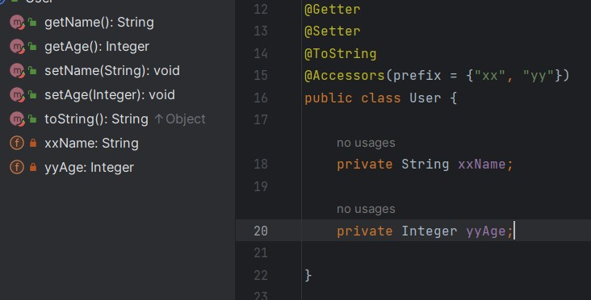

## 依赖包
```pom
<dependency>
  <groupId>org.projectlombok</groupId>
  <artifactId>lombok</artifactId>
  <version>1.18.24</version>
</dependency>
```

## @NoArgsConstructor/@AllArgsConstructor 注解
为该类生成无参构造方法和包含所有参数的构造方法
注解使用位置：类
```java
@NoArgsConstructor
@AllArgsConstructor
public class User {
    private String name;
    private Integer age;
}
```
编译后生成 class 如下：
```java
public class User {
    private String name;
    private Integer age;

    public User() {
    }

    public User(String name, Integer age) {
        this.name = name;
        this.age = age;
    }
}
```
> 注意：此注解不会把父类的属性 id 拿到 User 的构造器里面去

## @Data 注解
相当于注解的集合，效果等同于 @Getter + @Setter + @ToString + @EqualsAndHashCode + @RequiredArgsConstructor 这 5 个注解的效果
```java
@Data
public class User {
    private String name;
    private Integer age;
}
```

## @Builder 注解
@Builder 注解提供复制的 builder apis

```java
@Builder
public class User {
    private String name;
    private Integer age;
}
```
编译后生成 class 如下：
```java 
public class User {
    private String name;
    private Integer age;

    User(String name, Integer age) {
        this.name = name;
        this.age = age;
    }

    public static UserBuilder builder() {
        return new UserBuilder();
    }

    public static class UserBuilder {
        private String name;
        private Integer age;

        UserBuilder() {
        }

        public UserBuilder name(String name) {
            this.name = name;
            return this;
        }

        public UserBuilder age(Integer age) {
            this.age = age;
            return this;
        }

        public User build() {
            return new User(this.name, this.age);
        }

        public String toString() {
            return "User.UserBuilder(name=" + this.name + ", age=" + this.age + ")";
        }
    }
}
```

## @ToString 注解
用于生成 toString() 方法<br>
注解使用位置：类
```java
@ToString
public class User {
    private String name;
    private Integer age;
}
```

## @Setter 注解
用于生成类中成员变量的 set() 方法，同时还可以为生成的方法指定访问修饰符，默认为：public <br>
注解使用位置：类/成员变量
```java
@Setter
public class User {
    private String name;
    private Integer age;
}
```

## @Getter 注解
用于生成类中成员变量的 get() 方法，同时还可以为生成的方法指定访问修饰符，默认为：public <br>
注解使用位置：类/成员变量
```java
@Getter
public class User {
    private String name;
    private Integer age;
}
```

## Accessors 注解
@Accessors 注解为 getter 和 setter 方法设计的更流畅的注解 <br>
这个注解要搭配 @Getter 和 @Setter 注解使用，用来修改默认的 setter 和 getter 方法的形式 <br>

### @Accessors 注解详解
- fluent 属性：链式的形式，可以使方法连缀起来进行编写
- chain 属性：流式的形式，默认：false
- prefix 属性：生成指定前缀的属性 getter 和 setter 方法，并且生成的 getter 与 setter 方法时会去除前缀

### fluent 属性
默认为：false，当该值为 true 时，对应字段的 getter 方法前面没有 get，setter 方法前面不会有 set
```java
@Getter
@Setter
@Accessors(fluent = true)
public class User {

    private String name;

    private Integer age;

}
```
编译后生成 class 如下：
```java
public class User {
    private String name;
    private Integer age;

    public User() {
    }

    public String name() {
        return this.name;
    }

    public Integer age() {
        return this.age;
    }

    public User name(String name) {
        this.name = name;
        return this;
    }

    public User age(Integer age) {
        this.age = age;
        return this;
    }
}
```

#### chain 属性
默认为：false，当该值为 true 时，对应字段的 setter 方法调用后，会返回当前对象，进行链式设置值
```java
@Getter
@Setter
@Accessors(chain = true)
public class User {

    private String name;

    private Integer age;

}
```
编译后生成 class 如下：
```java
public class User {
    private String name;
    private Integer age;

    public User() {
    }

    public String getName() {
        return this.name;
    }

    public Integer getAge() {
        return this.age;
    }

    public User setName(String name) {
        this.name = name;
        return this;
    }

    public User setAge(Integer age) {
        this.age = age;
        return this;
    }
}
```

#### prefix 属性
该属性是一个字符串数组，当该数组有值时，表示忽略字段中对应的前缀，生成对应的 getter 和 setter 方法 <br>
如果我们把它的前缀加到 @Accessors 的属性值中，则可以像没有前缀那样，去调用字段的 getter 和 setter 方法
```java
@Getter
@Setter
@Accessors(prefix = {"xx", "yy"})
public class User {

    private String xxName;

    private Integer yyAge;

}
```
